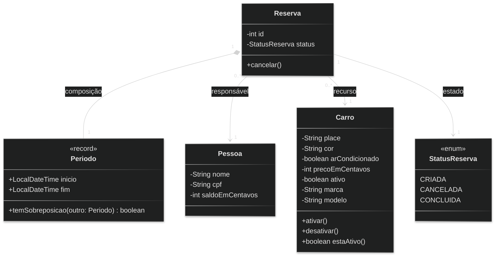

```mermaid
---
config:
  theme: dark
  look: neo
---
classDiagram
    
    class StatusReserva {
      <<enum>>
      CRIADA
      CANCELADA
      CONCLUIDA
    }
    
    class Pessoa {
      -String nome
      -String cpf
      -int saldoEmCentavos
    }
    
    class Carro {
      -String place
      -String cor
      -boolean arCondicionado
      -int precoEmCentavos
      -boolean ativo
      -String marca
      -String modelo
      +ativar()
      +desativar()
      +boolean estaAtivo()
    }

    class Periodo {
        <<record>>
        +LocalDateTime inicio
        +LocalDateTime fim
        +temSobreposicao(outro: Periodo) boolean
    }

    class Reserva {
      -int id
      -StatusReserva status
      +cancelar()
    }
    
    Reserva "1" *-- "1" Periodo : composição
    Reserva "0..*" --> "1" Pessoa : responsável
    Reserva "0..*" --> "1" Carro : recurso
    Reserva "1" --> "1" StatusReserva : estado
```
